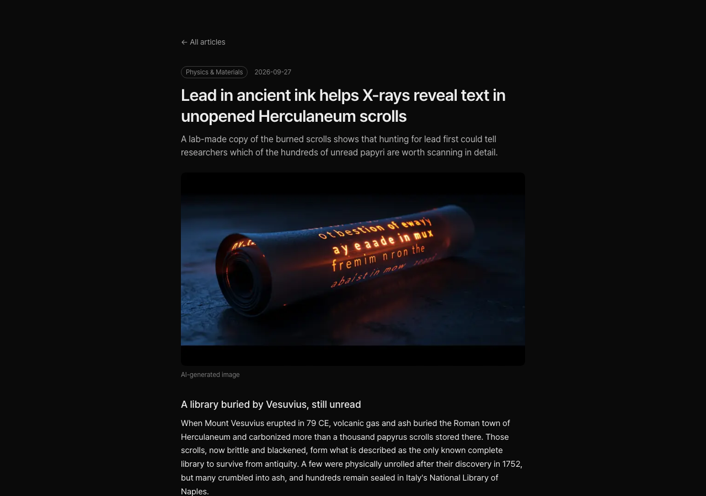
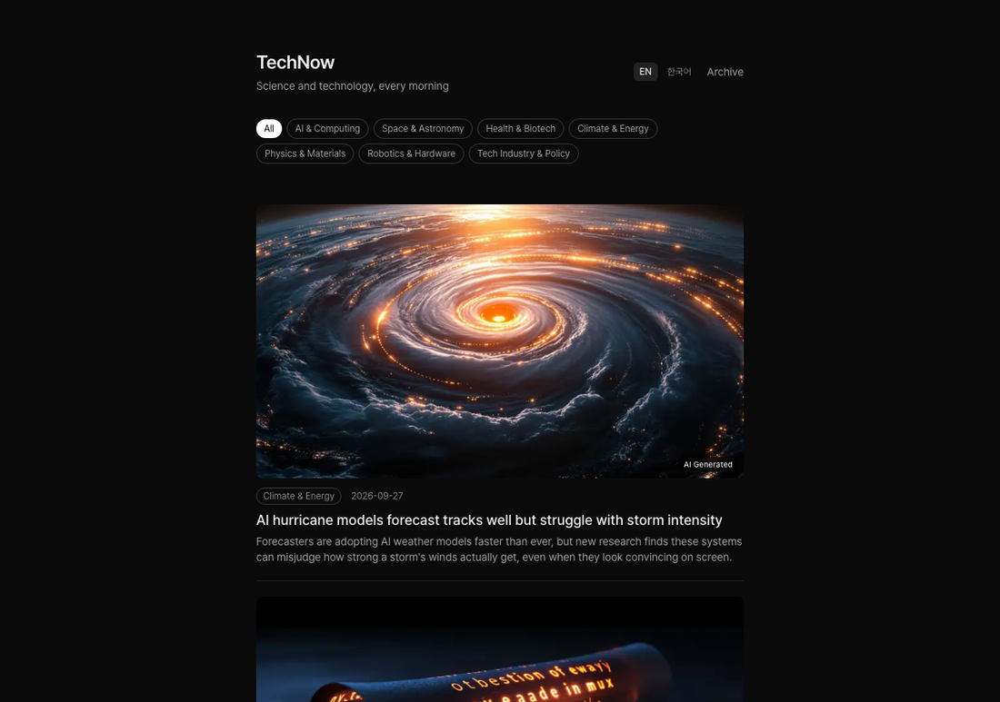
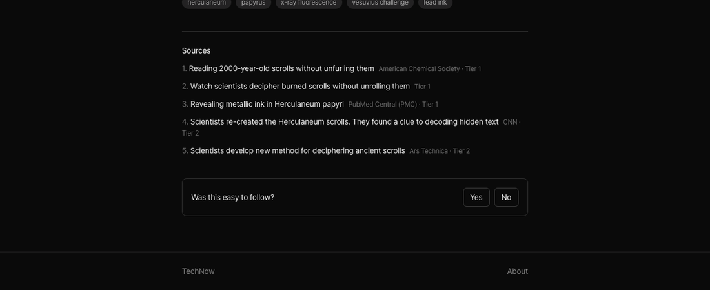
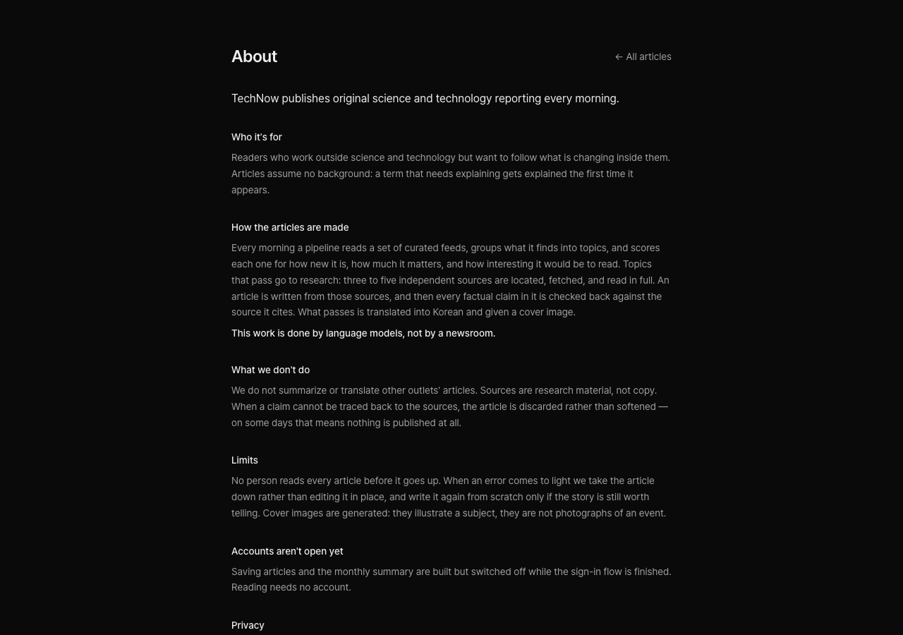

# TechNow

A science and technology news site that **writes itself every morning**. A pipeline finds
what happened, researches each story across three to five independent sources, writes an
original article in English, **checks every factual claim back against those sources**,
translates it to Korean, generates a cover image, and publishes at 07:00 America/Los_Angeles.
Nothing is summarized or translated from another outlet — sources are research material,
not copy.

Every line of code here was written by **Claude Code**, under a rule set and a decision log
kept in the repository. The interesting part is not that a model wrote a pipeline; it is the
constraints built around it so that what it publishes can be trusted — rules enforced in code
rather than requested in prompts, and a record of the hypotheses that measurement threw out.
That section is [below](#how-this-was-built).

**Live:** [technow-seven.vercel.app](https://technow-seven.vercel.app)

<p align="center">
  
</p>

---

## Overview

Three scheduled jobs, and nothing else moving:

| When (America/Los_Angeles) | Job |
|---|---|
| **01:00 daily** | Discover topics, score them, research the winners, write, verify, translate, illustrate — up to `ready` |
| **07:00 daily** | Publish everything that reached `ready`. Nothing half-finished is ever shown |
| **1st of month, 08:00** | Send each reader a summary of the articles they saved |

Publishing is a separate schedule from the pipeline on purpose: if generation breaks, yesterday's
finished articles still go out on time.

```
01:00 PT   discover   pull 5 curated RSS feeds, drop what we have already seen
           filter     length, promo language, keywords          (code, no LLM)
           group      cluster items into topics, match against
                      the last 7 days of published titles       [Haiku]
           score      novelty · impact · interest, 1-5 each,
                      plus kind and category                    [Haiku]
           rescore    fetch the trigger page for the top
                      candidates and score them again           [Haiku]
           select     walk the ranking, deciding each candidate
                      against what has actually been built

           per topic, in order:
             research   generate queries, search, filter by source
                        tier, fetch and extract article text
             write      structured JSON article                 [Sonnet]
             verify     extract claims, check each one against
                        the sources it cites                    [Sonnet]
             translate  Korean                                  [Sonnet]
             illustrate cover image                             [Flux Pro Ultra]

07:00 PT   publish    everything that reached `ready`
```

What gets published is settled by a fixed rule, not by a model's judgment. Today's profile
publishes two articles a day:

```
total >= 10 && every axis >= 3   → passes the threshold
a paper is already built today   → skip      (this profile allows one)
its field is already used today  → skip
the daily cap is full            → stop
```

Topics are tried in ranked order, and **each decision is made against what actually got
built**, not against a list drawn up in advance — research fails often enough that the two
differ. Switching to one article a day is one environment variable; that profile prefers
non-papers and only falls back to a paper when nothing else can be built.

If a topic cannot find enough sources, or a claim cannot be traced back to one, the article
is discarded and the next candidate is tried. **An empty day is an acceptable outcome; a
wrong article is not.**

**Categories** — AI & Computing · Space & Astronomy · Health & Biotech · Climate & Energy ·
Physics & Materials · Robotics & Hardware · Tech Industry & Policy

### Screenshots

<table>
<tr>
<td align="center" width="33%"><br><sub>Home — today's articles</sub></td>
<td align="center" width="33%"><br><sub>Sources — every article ends with them</sub></td>
<td align="center" width="33%"><br><sub>About — how articles are made</sub></td>
</tr>
</table>

Every article ends with the sources it was built from, each marked with the tier its domain
sits in, so a reader can check a claim the same way the pipeline did.

---

## How this was built

This is the part worth reading. The pipeline is ordinary TypeScript; what makes its output
publishable is the scaffolding around the agent that wrote it.

### Rules that are enforced, not requested

`CLAUDE.md` holds a short list of rules that may not be broken, and they are the reason the
code looks the way it does. They live in code, not in a system prompt:

- **Grounding is a gate, not a warning.** An article whose claims fail verification is
  discarded, and the next candidate is tried. There is no path that softens a failure into a
  caveat, and fewer articles is the accepted price.
- **Published articles are never edited.** A mistake is unpublished; if the story still
  matters it is rewritten from scratch as a new article.
- **Cost ceilings are counters at the call site.** Searches per topic, pages fetched, images
  per article, articles per day — each is checked before the call rather than asked for in a
  prompt.
- **Row level security on every table, no exceptions.** The web app carries only the anon key;
  unpublished drafts are invisible to it. The service role key exists in the batch environment
  and nowhere else, and a test suite tries to reach private data with the public key.
- **The four steps that read source text share one model.** They also share a prompt prefix,
  so the sources are cached instead of re-sent. Changing the model of any one of them silently
  multiplies cost, so it is written down as a rule with a test behind it.

### A decision log that keeps the wrong turns

`docs/DECISIONS.md` holds 62 entries. They record why a choice was made and what was measured —
including the times the measurement said no:

- Articles were too academic. The first hypothesis was that ranking by total score let
  importance beat reader interest. Simulating every alternative ranking changed almost nothing —
  the same topics won. **Rejected.**
- The second hypothesis was that the scoring rubric's anchors were too academic. Rewriting them
  with everyday examples moved the interest distribution in the *wrong* direction and made the
  list more technical. **Rejected.**
- The actual cause was the candidate pool: two thirds of it was paper press-release feeds, and
  the novelty anchor defined a paper published today as maximally novel. The fix was a counter
  that caps how many papers a day can be, not another attempt at nudging scores. **Adopted.**

Three attempts, two of them failures, all three in the log. The failures are the useful part:
they are why the third attempt was a structural constraint instead of more prompt-tuning.

### Prompt changes are measured, not adopted because they read well

Anything that calls a model is exercised against `fixtures/` — real topics with their source
text cached — so a prompt can be iterated without paying for live search or getting a different
answer each run. Adoption is decided by computed numbers: pass rate, first-attempt rate, and
cost per *published* article.

The rubric judge was itself measured first: its noise is about ±0.4 per article, which is why
its scores are read as direction only and the calculated metrics decide. One accepted change
moved first-attempt success from 29% to 64% and cut cost per published article by 40%; two
others were measured and thrown away.

### Bugs found by reading production, then fixed structurally

The paper cap looked like it worked for two months. Reading seven days of per-attempt token
usage showed it did not: when a chosen topic failed research, the loop fell through to papers
the cap had already blocked — on one day the cap chose three articles and five were built.

The fix was not a patch to the loop. Selection became a walk that re-decides each candidate
against what has actually been built, capacity is checked last so a skip reason never
misreports as "no room", and the failing case became a regression test. The same reading
turned up a prompt-cache setting that silently disabled itself, recorded with its measured
value rather than fixed on a hunch.

### Cost is instrumented like a product metric

Every run writes what it spent to `pipeline_runs`, because the free log tier keeps a day and
the database is the real record. A monthly projection runs at the end of each run and alerts
above a threshold. The current profile measures **$20.39 a month** end to end, including
models, search and image generation.

> The documents linked here are written in Korean — the code, prompts, and published articles
> are in English.

---

## Tech Stack

| Layer | Choice |
|---|---|
| Web | TypeScript, Next.js 16 App Router (`proxy.ts`, not `middleware.ts`), Tailwind CSS 4, next-intl with `/en` and `/ko` |
| Data | Supabase — Postgres, Auth, Storage; RLS on every table; 13 migrations, schema changes only ever as new files |
| Batch | Trigger.dev — three schedules, thin task wrappers over pure pipeline functions |
| Models | Claude Sonnet 5 for everything that reads source text, plus translation; Claude Haiku 4.5 for query generation, grouping and scoring |
| Research | Brave Search for links only; extraction is ours — Readability-style parsing, robots.txt respected, identifiable User-Agent, per-domain delay |
| Images | fal.ai Flux Pro v1.1 Ultra, one cover per article, labelled "AI Generated" in the UI |
| Testing | Vitest — 544 unit tests, plus a separate live suite that is never part of `pnpm verify` |

---

## Architecture

```
  Next.js (Vercel)                     Trigger.dev
  public pages, saved articles         01:00  discover → ready
  reader settings                      07:00  publish
  anon key + RLS                       monthly summary
            \                                /
             \                              /  service role key
              ▼                            ▼
          Supabase — Postgres · Storage · Auth · RLS
```

The web app never writes articles, and the batch environment never serves a request. The
service role key exists only on the right-hand side.

```
src/
  app/[locale]/     App Router — article pages, archive, about, saved articles, settings
  proxy.ts          locale redirect + session refresh (Next 16 renamed middleware.ts)
  clients/          Anthropic · Brave · fal
  config/           tuning values: models, profiles, thresholds, feeds, filters, source tiers
  db/               types, query helpers, Supabase clients (anon / server / service)
  pipeline/         the logic — pure functions, no Trigger.dev or Supabase imports
  trigger/          Trigger.dev task definitions — thin wrappers over pipeline/
  prompts/          prompt templates and their zod output schemas
fixtures/           real topics with cached source text, for repeatable prompt runs
supabase/migrations/
docs/
```

The boundary that matters: **`src/trigger/` is thin, `src/pipeline/` is thick.** A task file
parses input, calls a pipeline function, and stores the result. Judgment that lives in a task
file cannot be tested against a fixture — so it does not live there.

---

## Build Timeline

| Phase | Delivered |
|---|---|
| 0 | Repository groundwork — Next.js 16, CI, secret-leak check, local Supabase stack |
| 1 | Foundation — schema and RLS on every table, auth, scheduled batches, RSS ingest, article list |
| 2 | Topic selection — cheap filters, grouping and follow-up detection, the scoring rubric, rescoring, thresholds, and a log that explains every accept and reject |
| 3 | Research and writing — search, source tiers, extraction, article generation, claim verification, retries, the publish task, per-run cost logging |
| 4 | Korean — locale routing, translation, and structural validation that the translation matches the original's sections and citations |
| 5 | Cover images — model comparison, a scene-selection step so abstract topics do not become colour fields, Storage upload |
| 6 | Saved articles and the monthly summary |
| 7 | Going public — rate limiting, category filters, failure and budget alerts, data-isolation tests, archive, About page, access gate removed |
| 8 | Toward the reader — "AI Generated" labelling, freshness filters, the paper cap, and publishing profiles |

---

## Getting Started

```bash
git clone https://github.com/Jin4202/TechNow.git
cd TechNow
pnpm install
```

```bash
pnpm dev          # http://localhost:3000
pnpm verify       # typecheck + lint + 544 tests + secret scan
```

Local Supabase stack (Docker required):

```bash
supabase start
supabase status
```

Copy `.env.example` to `.env.local` and fill it in. **App keys and pipeline-only keys never
mix** — the service role key must not reach the Next.js runtime, and a CI check fails the build
if it does.

Requirements: Node 22, pnpm, Supabase CLI, Docker for the local stack.

---

## Testing

- **544 unit tests** over pure functions — selection rules, scoring, cost projection, rate
  limits, translation validation, locale routing.
- **Fixtures instead of live calls.** Steps that call a model run against cached source text,
  so prompt work is repeatable and cheap. The live suite (`tests/live/`) is opt-in, costs real
  money, and is excluded from `pnpm verify`.
- **Data isolation is tested, not assumed.** A script attempts to read another user's rows and
  unpublished articles with the public key; every table must return nothing.
- **Regression tests for bugs that shipped**, including the paper cap that leaked through
  fallback attempts.

---

## Project Docs

| Doc | Contents |
|---|---|
| [CLAUDE.md](CLAUDE.md) | Working rules, the non-negotiables, project structure |
| [docs/ROADMAP.md](docs/ROADMAP.md) | Phases, completion criteria, current position |
| [docs/ARCHITECTURE.md](docs/ARCHITECTURE.md) | Runtime boundaries, pipeline flow, data model, RLS |
| [docs/DECISIONS.md](docs/DECISIONS.md) | 62 decisions with their reasons and measurements |
| [docs/RUBRIC.md](docs/RUBRIC.md) | The scoring rubric and its calibration history |
| [docs/STYLE_GUIDE.md](docs/STYLE_GUIDE.md) | How articles are written and translated |
| [docs/MASTER_PLAN.md](docs/MASTER_PLAN.md) | The original plan |

---

## Roadmap / Known Limitations

Deliberate, and documented as non-goals from the start:

- **No rewriting other outlets.** Sources are research material; articles are written from them.
- **No publishing without grounding.** If claims cannot be traced to sources, the day ends with
  fewer articles, or none.
- **No editing a published article.** Corrections take it down; a rewrite is a new article.
- **No chatbot, no personalization, no comments.** Out of scope on purpose.

Honestly still missing:

- **Accounts are switched off.** Saving articles and the monthly summary are built and tested
  but locked behind a flag until email confirmation is wired up.
- **No custom domain yet** — the site runs on its `vercel.app` address.
- **Sentence length is outside the target band**, a known debt from a prompt change that was
  adopted for its grounding gains.
- **Category prediction accuracy is unmeasured.** Selection avoids publishing two articles from
  the same field using a prediction made at scoring time; how often that prediction is wrong is
  recorded but not yet analysed.
- **Two prompt steps do not share their cache** because their effort settings differ. Measured,
  logged, not yet fixed — the saving is small enough that it needs a measurement first.

---

Repo: [github.com/Jin4202/TechNow](https://github.com/Jin4202/TechNow) · Live:
[technow-seven.vercel.app](https://technow-seven.vercel.app)
